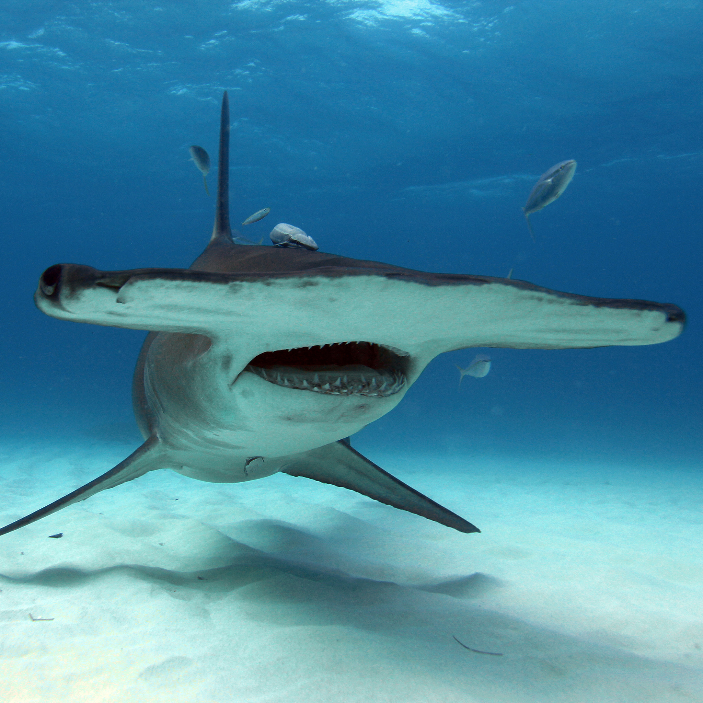

# Animal-Trading-Cards
Udacity fend - Animal Trading Card

<!DOCTYPE html>
<html>
<head>
	<meta charset="utf-8">
	<title>Animal Trading Cards</title>
	<link href="styles.css" rel="stylesheet">
</head>
<body>
	

		<!-- your favorite animal's name goes here -->
		<h3>Hammerhead</h3>
		<!-- your favorite animal's image goes here -->
		
		

			<!-- your favorite animal's interesting fact goes here -->
			
Its has a famous Google nexus named after it!

			<ul>
				<!-- your favorite animal's list items go here -->
				<li>Weight (Avg): 1000 pounds</li>
				<li>Length (Avg): 3 to 20 ft</li>
				<li>Vision: 360&#176;</li>
				<li>Max Speed: 25 mph</li>
			</ul>
			<!-- your favorite animal's description goes here -->
			
Hammerhead shark is probably the weirdest type of sharks. There are nine species of hammerhead sharks that inhabit all oceans of the world. Hammerhead sharks can be found both in deep and shallow waters.

		

	

</body>
</html>
